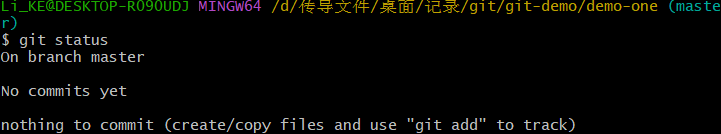
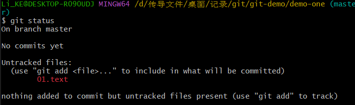
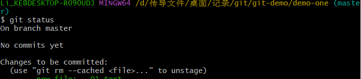
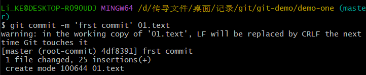
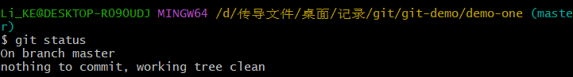
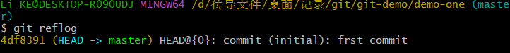
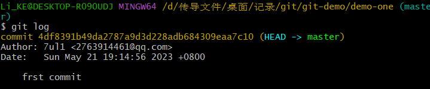

## Git常用命令

> 注：该用户名和用户邮箱与之后登陆GitHub的账号没有任何关系-该作用只用于区分是哪个用户操控的
- **第一个使用Git时设置用户签名**：
  - 设置用户名 + 用户邮箱
  - git config --global user.name xxx
  - git config --global user.email xxx
- **初始化本地库**
  - git init
- **查看状态**
  - git status
    
  - On branch master - 当前本地库是在**哪个分支**里面(现在在master)
  - No commits yet - 目前还**没有提交过**东西
  - nothing to commit (create/copy files and use "git add" to track) - **没有创建**任何文件提交
    
  - 此处出现**未被追踪**的文件(红色文件只表示为存在于工作区，git未追踪该文件)
  - nothing added to commit but untracked files present (use "git add" to track) - 可以使用该命令追踪文件，添加到**暂存区**
- **添加暂存区**
  - git add xxx 添加某个文件到暂存区(追踪某个文件)
  - git add 添加所有的文件到暂存区(追踪所有的文件)
  
  - 此处文件颜色显示为绿色，则表示该文件已被git追踪到
- **删除文件-取消追踪**
  - git rm --cached xxx
  注: 该命令并不会删除本地文件，只是在git上对它取消了管理(在暂存区删除掉它)
- **提交本地库**
  - git commit -m xxxx 这里xxxx表示日志信息
  
    >[master (root-commit) 4df8391] frst commit
    > 1 file changed, 25 insertions(+)
    > create mode 100644 01.text
  - 表示文件已被提交到本地库，列出什么文件及日志信息
  - 这里`4df8391`为该次提交的版本号
  - 再次执行 git status命令
  
  - nothing to commit, working tree clean 表示你已经提交过但未进行修改，已经被加入了tree
- **修改文件**
  - 修改文件后
  - git status 查看文件变红则是修改了的
  - git add 再次添加到暂存区
- **历史版本**
  - **查看历史版本**
    - git reflog 查看版本信息
    
    - git log 查看详细的日志信息
    

  - **版本穿梭**
    - git reset --hard xxx 查看版本号
    - 目录中：.git/HEAD 文件里存放着路径-版本号路径
    - refs/heads/master 文件里显示的版本号路径
    - master 文件存放的是
    - 一个概念：指针
    - 在选中哪个版本时，其实就是指针在动，我们看到的是HEAD文件而HEAD文件的指针指向master，在master里指针根据我们选中的哪个版本而变。

- **隐藏技巧(linux命令)**
  - ll 查看文件
  - ll -a 查看隐藏文件
  - cat xxx 查看文件
  - tail -n 1 xxx 查看文件末尾的第一行

- **创建文件**
  - vim 01.text
  - **vim操作**
    - esc 进入命令模式
    - i 进入插入模式
    - yy 复制
    - p 粘贴
    - :进入下方操作行
    - wq 退出vim操作

