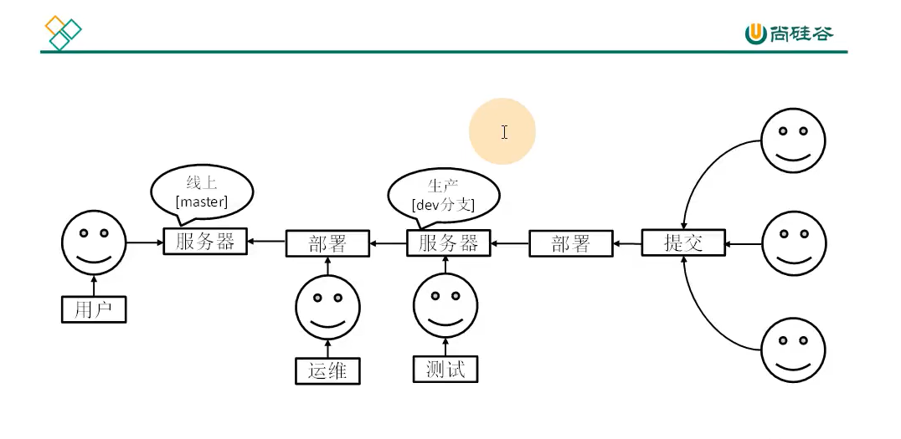
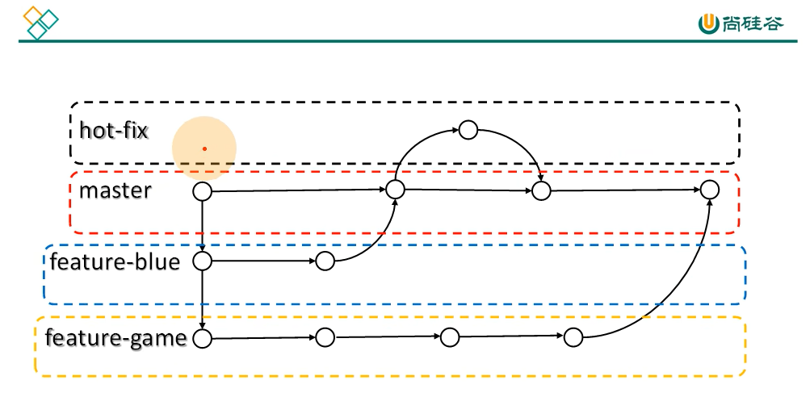
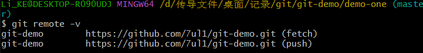
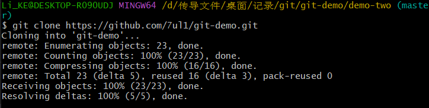
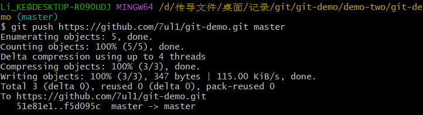
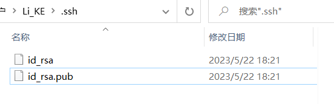
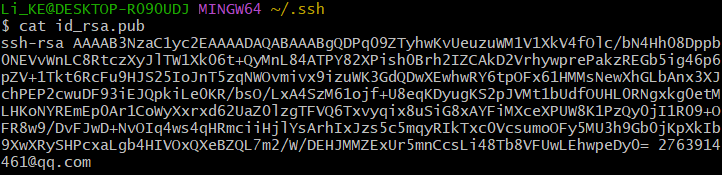

> <a href='./GItSY.md'>git操作文档</a>

# 一、Git 分布式版本控制 + 集中式版本控制

### 教程描述：

- **git工具**
- 去git官网下在git安装包
- 主要应用git的常用命令
- 理解git分支的特性、转换、创建、合并、以及代码合并冲突
- idea中如何使用git
<!-- --- -->
- **github了解**
- 创建远程库
- 代码推送 push
- 代码拉取 pull
- 代码克隆 clone
- SSH免密登录
- 如何在idea中集成github
<!-- --- -->
- **Gitee码云**
- 创建远程库
- idea中集中gitee
- 码云链接github进行代码的复制与迁移
<!-- --- -->
- **gitlab**
- 基于局域网的代码托管中心
- gitlab服务器的搭建与部署
- idea集成gitlab
<!-- --- -->
**课程目标**：熟练掌握git、github、gitlab、gitee使用

## git介绍:

> 一个**分布式**的版本控制工具，可快速高效的处理从小型到大型的各种项目
> **易学习、占地小、性能极快**

#### 集中式：

- 一个问题：**单点故障**
- 以一个服务器为中心，从它身上获取资源的客户端都只能靠它。
- 若该服务器停止了，客户端们就无法从它身上获取资源了，但用户可以将先前从它身上下载下来的资源版本进行更改后，等服务器启用时再将更改后的资源提交上去
- 对于这个服务器每个人只能一个一个操作，无法同时批量操作提交资源，好比员工A从中下载了一个资源A，他正在修改，在这期间员工B也想修改，就只能下载资源A，员工A修改完后提交形成资源B，B员工修改完后提交是资源C，但这里面的资源内容不一样，资源B与C都有A的数据但后面修改的不一样了，两个人修改的内容无法覆盖

---

- 当**中央服务器**发生单点故障时，其他客户端都**无法**再向其上传或进行其他资源的**操作**，若该服务器宕机一小时则也得一小时后再进行操作
   
#### 分布式：

- 也是有一个中央服务器，也会有有很多客户端向其发送请求
- 后续客户端修改并提交资源时，若服务器停止了并不会有什么问题，因为服务器内的资源已经拷贝到了请求的客户端下面了，再以他为中心成为的服务器。
- 多个员工同时修改一个文件时并不会出现集中式的场景，它会在A员工修改完后的数据B里添加上B员工修改完的数据C，这两个数据会合并添加并形成一个新的资源D。
---

- 一个概念：**远程库（代码托管中心）**
- 在分布式里面**没有**中央服务器概念，每个人都可以在自个的电脑进行操作
- **没有单点故障的问题**

# 二、git历史-工作机制

- 历史：linus大神开发**linux**时，有个linux社区，在这社区里大家一起改正linux系统，在改动时他人改好的一个小功能要加到系统里就需要给linus大神一个一个对比再修改添加上，所以麻烦了，后BiMover公司将BitKeeper工具让linus大神免费用，05年时linux社区的一个人破解了该软件违反了两者的条例所有被收回了，不让用了，后来linus大神亲手开发了git这个工具且开源了，并且开发了GitHub社区，各路框架、技术都将代码放到上面进行托管。
---
- **工作区** (git add)-> **暂存区** (git commit)-> **本地库** 
- 工作区 - 写代码
- 暂存区 - 临时存储
- 本地库 - 历史版本
---
- **代码托管中心**是基于网络服务器的**远程代码仓库**---**远程库**(代码托管中心 = 远程库)
- 代码在本地库生成了**历史版本**即可将代码推送到远程库(git push)
- 代码托管中心
  - **局域网**：
    - GitLab
  - **互联网**：
    - <a href="https://github.com/">GitHub(国外)</a>
    - <a href="https://gitee.com/">Gitee(国内)</a>

# 三、git分支

  
  

  > **什么是分支**
  分支可以理解为它有一条主线，在主线上是该项目的主体，而当你想要给该项目添加一个功能，那么你就可以以该分支再**创建一个分支**，在这条**创建的分支**上进行操作调试等等，当该功能调试运行都可以了的时候再将该分支文件**放到主线**上面就可以了(可以相当于是游戏版本号了)

  > **分支的好处**
  可以**同时**进行多个功能的**开发**，**提高开发的效率**
  各个分支在开发过程中，**不相互干涉**，若**一个分支开发失败**了，**并不会**对其他分**支产生影响**，可以把失败的分支删掉后**重新开始**即可
  
  #### 分支的操作
  - git branch xxx 创建分支-xxx为分支名
  - git branch -v 查看分支
  - git checkout xxx 切换分支-xxx为分支名
  - git merge xxx 把指定的分支合并到当前分支上-xxx分支名
  
  > 这里建立了分支后会形成**两条线**，一个是master**主分支**，另一个是**其他分支**，在目录的**refs的heads**里可查看，两个分支文件的指针指向的是**不同的文件版本**

# 四、团队协作

  **团队内协作：**
  > 当员工A将项目代码整体添加到远程库（用到了push命令将项码添加到远程库）想让大家一起来查错或补充修改，然后员工B程库复制了该项目代码到本地（用了clone命令复制远程库代码地），员工B将代码修改完了后想将这个代码添加到远程库让员以及大家一起检查一番，就需要员工A将权限授予给员工B，则员将代码添加到了远程库（用到了push命令将代码上传到远程库-必须要得到授权才能将代码添加到远程库，否则不给权限就能就会给该项目带来大麻烦），员工A以及大家可以将代码拉取下本地再进行修改或检阅后上传到远程库（通过pull命令将代码程库拉取下来）

  - git push url master 上传代码到远程库
  - git pull url master 克隆代码到本地
  - 团队内协作也就是将这几步重复执行罢了
  - 给予权限即时加入团队：
    > github 打开 settings -> collaborators -> add people -> 即可将人拉入团队
  - 在被邀请方点击接收即可进入团队

  **跨团队协作**
  > 当该项目的代码遇到瓶颈需要求助时就将该代码的远程库链接一下到团队B里的远程库（通过fork命令将代码插入到团队B里），让他们帮忙修改，团队B里将代码复制到本地后（通过clone命令复制），修改完毕了再将代码上传到团队B的远程库里，然后让团队A的人把代码拉去过去（通过pull request命令），然后经过审核后再把代码进行合并到团队A的远程库里面，这样团队A里的人都可以使用此代码了

# 五、GitHub操作

  - git remote -v 查看别名
  - git remote add xxx url 设置别名（此处别名最好和库名保持一致） url 为库的链接地址
  
  - 此处两个别名一个表示可推送一个表示可拉取
  - push + clone + pull 
  - git push xxx(别名) xxx(分支：例如master) 上传代码到远程库
  - git pull xxx(别名) xxx(分支：例如master) 从远程库拉取代码到本地
  - 在他出进行数据的克隆（clone命令） -此处是在本地电脑在克隆
  
  - 在第二个配置里运行：git clone url(github库的链接)
  - 即可将远程库里的代码进行克隆
  - 在克隆代码的时候运行的步骤为：拉取代码、初始化本地仓库、创建别名
  
# 六、SSH加密

  **此处的邮箱号可以改(可设置为GitHub所用邮箱)**
ssh-keygen -t rsa -C 2763914461@qq.com 即可生产.ssh文件和密钥

  **生成文件**
.ssh文件夹内部两个文件(密钥)

  **密钥文件**
字串末尾为指定的邮箱

